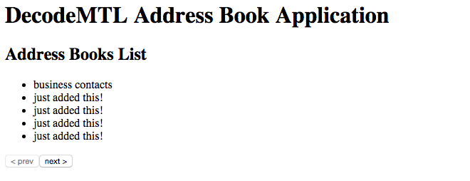
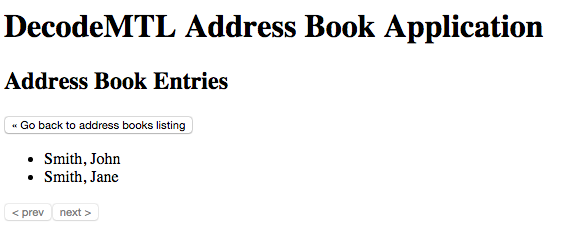

add,edit and delete buttons

# jQuery Address Book

## IDEA ZONE ######################################

-attach class to article at time of query to include icons in top right corner
-attach .selected class to articles and also remove 
-add edit and remove functions (Via cog icon and toolbar.js http://paulkinzett.github.io/toolbar/!)
-add map to address entries (http://hpneo.github.io/gmaps/examples/static.html)
-fade left jquery: http://git.blivesta.com/animsition/slide-top/

###################################################

## Introduction
This is the skeleton for an address book front-end application based on [the address book API](https://loopback-rest-api-demo-ziad-saab.c9.io/explorer/).

The API itself is hosted at https://loopback-rest-api-demo-ziad-saab.c9.io/api and is [CORS-enabled](https://en.wikipedia.org/wiki/Cross-origin_resource_sharing),
loosely meaning "you can access it thru AJAX from any domain".

The application code was initialized with a `package.json` file. Eventually we will be adding our browser dependencies
thru NPM. Meanwhile, take a look at the `scripts` section of `package.json`. In it we can define command lines that we
will be running often. The app is initialized with two such commands: `dev` and `build`. As you sit down to start your
coding day, you can launch `npm run dev` from your command line and it will start the sass watcher. If you want to compile
your SASS in compressed form, you can use `npm run build` which will run sass with the `--style compressed` option. This
is much easier than remembering the full commands, and the scripts can be arbitrarily complex.

In `index.html`, we removed all the content of the body and replaced it with a single `div` with ID `app`.
This is a common pattern when creating a [Single-Page Application](https://en.wikipedia.org/wiki/Single-page_application).
Indeed, our application will not be refreshing the browser's page when we interact with it. It will use
AJAX requests to talk to an API, and display the results live.

In `js/app.js`, we created a basic skeleton for the application. This JavaScript file is divided into
multiple sections:

  1. Initialization section, where we set some "constants" -- a convention for a variable that should be constant is writing it in uppercase.
  2. A data-retrieval section. This presents a set of functions that talk to our API. The functions are
using `jQuery.getJSON` to talk to the API and retrieve some content. 

  You will need to add some more functions
in there and complete some existing functions. The functions in there return the result of `jQuery.getJSON`,
which is a promise-like object on which you can call `.then`. You can see these functions being used in the
next section.
  3. A "views" section. The functions in there will use the data-retrieval functions to get some data from
the API, and then use some of jQuery's [DOM Manipulation](https://api.jquery.com/category/manipulation/) functions
to display the retrieved content on the page.

*Take your time* to identify these different sections in `app.js`, and look at the code in there.

Look more closely at the `displayAddressBooksList` function on line `38`.
Here we are creating elements that look like this: `<li data-id="1">some name</li>`. This is a common pattern,
where we are attaching a piece of data to an HTML element. Later on, when this element is clicked,
we are retrieving the ID -- in this case it's the ID of the address book we are displaying -- and then
calling another function with it (look at line `42`)

## Work
Complete the provided application skeleton to get the following things done:

1. Upon entering the interface, the user should see a list of the first 5 address books, sorted by name
2. Below the list, there should be two pagination buttons: previous page and next page
3. The buttons should be active/inactive depending on whether there are more results to show
4. The address book names should be clickable. Upon clicking on an address book name, the interface switches to show a list of entries
5. The list of entries should show the first 5 entries, sorted by last name. Each entry should be displayed as Last Name, First Name
6. Above the list of entries should be a link to go back to the address book listing
7. Below the list of entries should be two pagination buttons, same as for the address book listing
8. The entries should be clickable. Upon clicking on an entry, the interface should switch to show the full entry using an HTML vertical table. The spec is the same as the command line version of the address book. Basically, display all the entry data as well as related data such as addresses, phones and emails.
9. Above the entry table should be a link to go back to the current address book

Without any styling added, your end result would have three different views:

Address books listing with pagination:

---

Entries list with pagination:

---

Single entry view (this is a basic example, your entry view will be much more complete):

---

## Challenge
As a challenge, add the following functionality:

1. When viewing an entry, an EDIT button is made available for each field
2. When clicking on EDIT, the view will toggle between "view" and "edit mode" for that field. Pressing ENTER will save, and Esc will cancel.
3. In "edit mode", the first name, last name and birthday will be changed to `<input>` elements. Editing them and pressing ENTER will change them thru the API
4. Each email, address and phone number will have a DELETE button next to it. Clicking this button should delete the entry in the API and update the UI
5. Each of email, address and phone sections will have an ADD button. Clicking this button should open a popup with a form to add a new sub-entry of that type